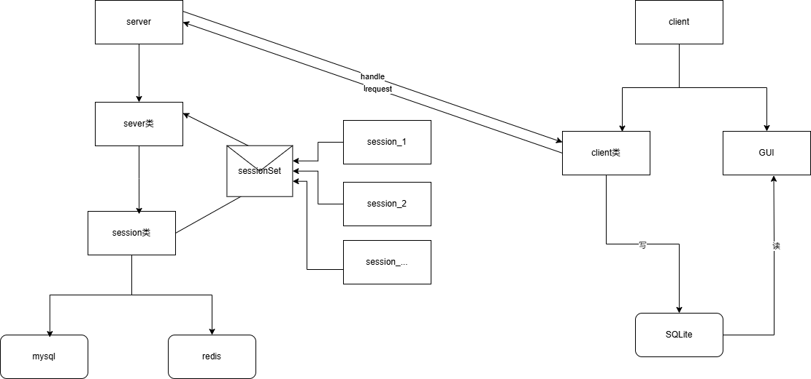

# WebChat

一个使用 C++20、Boost.Asio、Qt 6、MySQL、SQLite、Redis 编写的练习型聊天室。

- Ubuntu 24.04
- CMake 3.28.3
- GCC 13.3
- Qt 6.4.2
- Boost 1.83
- MySQL Connector/C++ 1.1.12
- MySQL 8.0

> 特别提醒：当前程序仅适合本地学习：密码仍以明文写入数据库，不要部署到公网或保存真实密码。

## 从源码构建（以服务端为例）

### 1. 克隆仓库

当前构建使用系统安装的 Boost，服务端数据链路只构建 MySQL 模块，客户端也没有接入 SQL++。因此，编译和运行当前程序只需要克隆主仓库，不必下载仓库中的子模块。

```bash
git clone --recurse-submodules https://github.com/Astraclicker/WebChat.git
cd WebChat/server
```

子模块较大，酌情-j 多线程下载

### 2. 安装编译和运行依赖(Windows端使用qt时需更改cmake文件，将顶层cmake路径替换为本机真实路径)

```bash
sudo apt update
sudo apt install -y \
    build-essential \
    cmake \
    ninja-build \
    libboost-dev \
    libmysqlcppconn-dev \
    mysql-server \
    qt6-base-dev \
    redis-server \
    redis-tools
```

### 3.构建

```bash
cmake -S . -B build -G Ninja && cmake --build build --config Release -v
```

### 4.编写config.json

client:

```json
{
  "Web": {
    "address": "127.0.0.1",
    "port": "9191"
  }
}
```

server:

```json
{
  "Web": {
    "address": "127.0.0.1",
    "port": 8080
  },

  "MySQL": {
    "address": "127.0.0.1",
    "port": 3306,
    "userName": "userName",
    "password": "****"
  },
  "Redis": {
    "address": "127.0.0.1",
    "userName": "",
    "port": 6379,
    "password": "****"
  }
}
```

